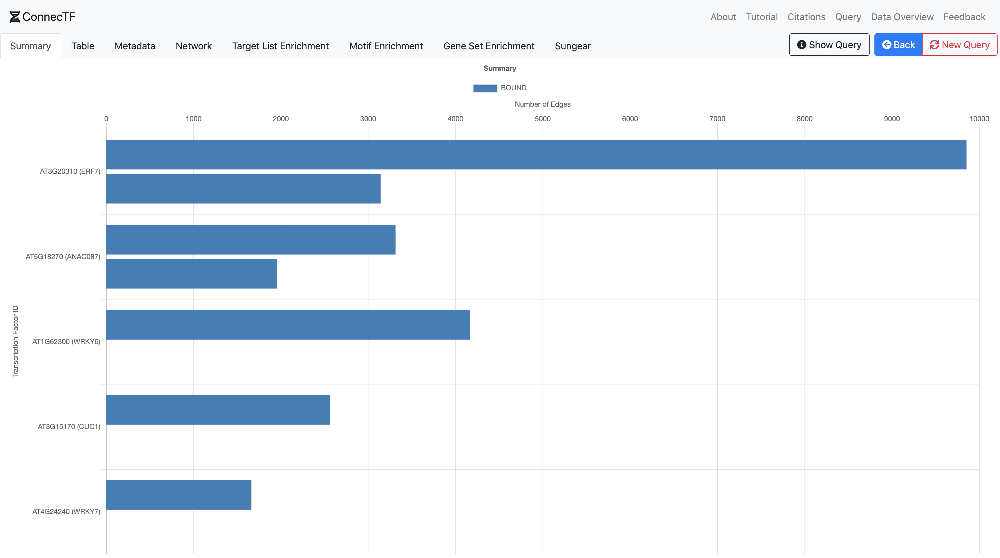

# Making a Query

## Searching for a Transcription Factor

Typing the name or ID of a transcription factor (TF) in the search bar brings up a list of available TFs in the ConnecTF database.

## Query Builder

### Adding Transcription Factors to a Query

For more complex queries, click **Add TF** to add one or more TFs to the query. Use **Add TF Group** plus drag-and-drop to arrange TFs into groups. Selecting **and** or **or** will query the target genes that form the intersection or union, respectively, of the TFs/TF Groups in the query.

#### Built-in Keywords for Common Queries

Special keywords have been added that allow users to easily query commonly used sets TFs. These include:

***all_tfs***  - query *all* TFs in the ConnecTF database
***multitype*** -  query TFs that have more than one "Experiment_Type" in the metadata
***all_expression*** - short hand query for "all_tfs[EXPERIMENT_TYPE = Expression]", returns all RNA-seq/microaray experiments
***in_planta_bound*** - short hand query for "all_tfs[EDGE_TYPE = in planta:Bound]", returns all binding experiments done in planta
***all_dap*** - short hand query for "all_tfs[EDGE_TYPE = in vitro:Bound:DAP or EDGE_TYPE = in vitro:Bound:ampDAP]", returns all DAP-seq binding experiments

*Caution!* The more transcription factors queried will result in a long wait time.

#### Build Query

Click the **Build Query** button to populate the search query input once all the desired TFs have been selected and grouped.

### Select Additional Edge Features

In the **Additional Edge Features** section, select additional edge features that you would like to be displayed alongside the results. (*e.g.* whether each edge is validated by DAP, etc.)

### Select A Target Gene List

The **Target Genes** allows user to limit the output of transcription factor targets to a user defined set of genes. Rather than returning all available targeted genes, only the selected subset of genes that are being targeted in the query will be returned. This can be used to limit the output of the query to genes you are interested in. Users can upload a file containing a list of gene IDs.

A predefined list of target genes from separate experiments are also available for selection. (See [citation](/citations))

### Select Filter TFs

The **Filter TFs** limits the *transcription factors queried* to a predetermined list. This only affects queried transcriptions factors, and not its targets.

### Select Target Network

The **Target Network** option uses the selected network to limit both queried transcription factors and their targets. Effectively limiting the output to the subset of the network provided.

A predefined list of gene networks from separate experiments are also available for selection. (See [citation](/citations))

---

# Results

## Summary

A horizontal bar chart detailing the number of targets per analysis per transcription factor. If there are greater than 50 transcription factors queried, only top 50 by target count will be displayed.

## Table

Displays all of the target genes of each analysis. If P-values and Log2 fold change are available they will be displayed. A "**+**" sign will be displayed if only binding data is available.

## Metadata

Metadata for each analysis is displayed here.

## Network

### Summary, Export, and Link to Graph  View

A summary of the network is included along with a link to the [Network Graph](#network-graph). An overview of how many edges, transcription factors, and targets are presented. There are also options to export the network as a [SIF](https://manual.cytoscape.org/en/stable/Supported_Network_File_Formats.html#sif-format) or JSON file, which you can open with [Cytoscape](https://cytoscape.org).

### AUPR — Area Under Precision Recall

*Disclaimer: Only Available if a [Target Network](#select-target-network) is selected during query.*

If a [Target Network](#select-target-network) is selected during the query.

### Network Graph

*Network Graph will be slow and will impact overall browser performance if the network has too many edges.*

Queried transcription factors are displayed as a group on the left side, with target genes on the right side, grouped by the number of targeting transcription factors.

Additionally, you can upload a list of edges to be displayed along with the current network with the "**Upload Edges**" button. Note that user uploaded edges will only connect existing genes in the network. No new genes will be placed in the network.

## Target List Enrichment

All the queried analyses will be checked against [uploaded gene list](#select-a-target-gene-list) or [uploaded network](#select-target-network) for enrichment.

Enrichment is calculated using a Fisher's exact test to check for significant overlap of an analysis' target genes and the gene list. P-values represents the probability of having an overlap greater than the one observed. All p-values are FDR corrected using the Bonferroni correction.

## Motif Enrichment

## Gene Set Enrichment

Gene set enrichment is the pairwise significance of overlap between all the analyses queried using the Fisher's exact test. The coordinates on the grid, with each row and column representing a different analysis, indicate which 2 analyses the cell represents, and the shading color indicates the significance off overlap. A darker color indicates an increased significance of overlap.

## Sungear

Sungear is a list overlap visualization tool conceptualized by [Poultney *et al*](/citations#tools).
